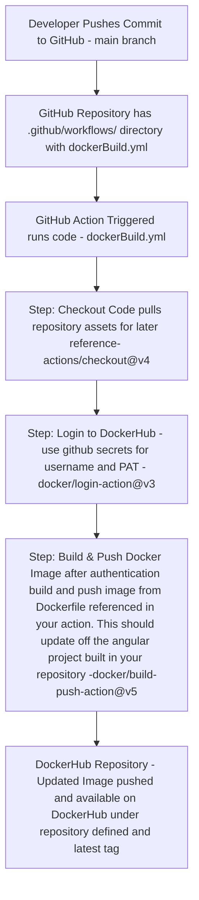
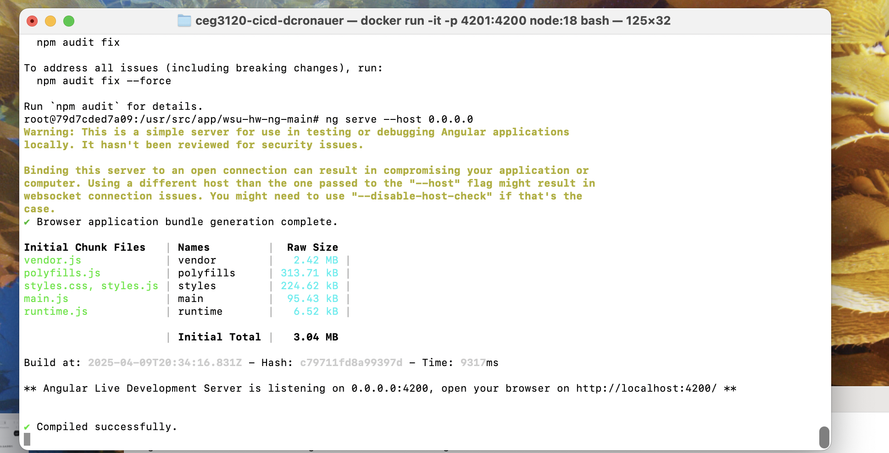
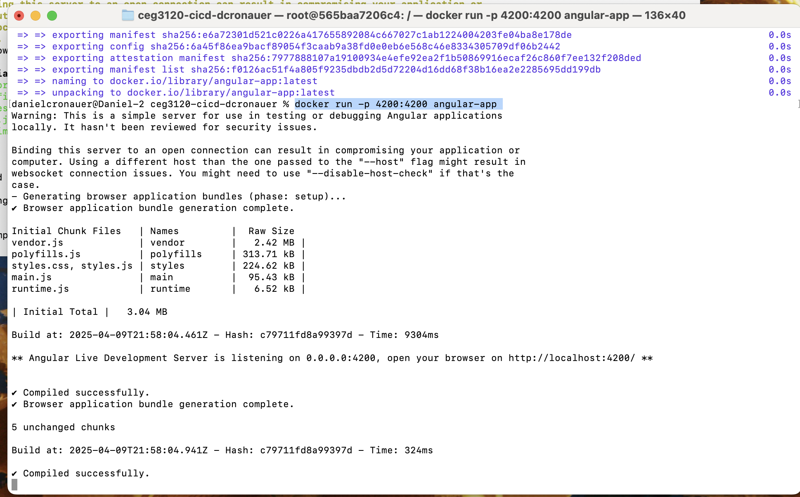
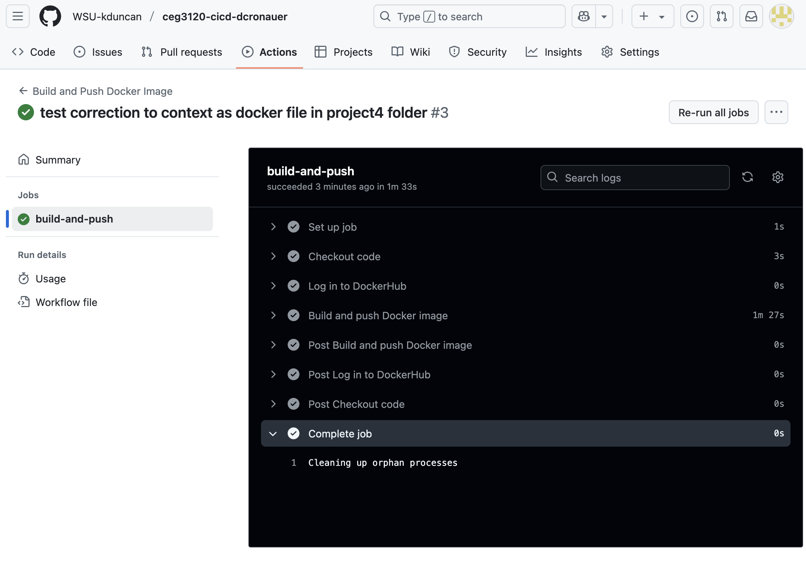
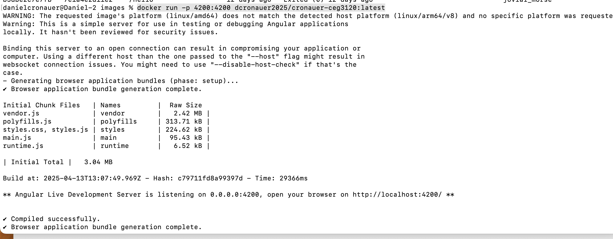

# Part 3 - Project Description and Diagram

## CI Project Overview goal

The intent of this project is to step away from AWS for a brief second in order to learn how to use Docker. 
This tool provides another way to spin up builds quickly and efficiently. Docker allows you to build up images,
define setup and then save that image for yourself and others to use. You or others can layer their own builds on top of 
an image and expand it out for other purposes. Docker containers are nice since they do not use the same process
as Virtual Instance machines that allocate CPU and RAM specifically for that instance. This allows Docker to be more
lightweight, easy to share and spin up, as well as more efficient to run. Once we have a working Docker file that builds,
runs, and listens on port4200. The angular server will listen on local host and serve up website requests locally. We also 
want to have changes saved on the repository update in Github. We utilize git hub workflow actions to listen for commits on the
main branch. When this occurs, it takes that Dockerfile built and then creates a new image based on the angular project currently
in the angular-site folder on the repository.

## Tools used

1. ***Github*** Of course we need a publically available Github repository to store the angular website, Dockefile, and workflow .yml file.
2. ***.github/workflows/filename.yml*** This .yml file is used to tell your github actions what triggers to listen for and the jobs and steps involved to respond to that trigger event.
3. ***Github workflow actions*** uses the .yml in /.github/workflows from root of repository. This .yml file defines a trigger point, jobs to run, in our case checkout the repo, loginto dockerhub, build image based off Dockerfile in github repository and then push to dockerhub repository. This action is the part that updates our image everytime we commit in order to capture potential changes to our website. This allows for automation of the project. There are other github actions that you can refer n order to streamline your workflow action. For example actions/checkout@v4 checkouts the repository that just triggered a workflow action in order to reference the files in that repository. 
4. ***Docker containers*** uses containers to define a minimal setup to run our website in controlled docker image that allows us to push this image to any machine and run it. These container images will install a minimal OS install and run inside your current OS. Often these containers focus on serving a specific process or service.
5. ***DockerHub*** acts like Github for containers. The github action workflow aims capture changes to the website folders in the github repository.  The workflow then builds a new docker container image with angular project updated and push it to a DockerHub repository in order for other machines to easily pull that image. In our case in project 3 you would have an easy place to call the same image for all three web servers and run the docker container. This is a nice device agnostic method for having a clean build and not introduce depenency issues on you local device. Just run the image and prosper. 
6. ***Dockerfile*** this is a file that is used to build a new image, or extend another image. You can install your needed libraries, files, etc and then serve the process/service that you want the docker image to handle. In our case an angular website. 
7. ***Angular*** We install angular in order to have an easy way to set up and serve a website for access on a webbroswer. This is a JS implementation for designing and serving a website using a JS library.

## Diagram of project



## References
1. Chatgpt prompt
```
can you take these requirements. 

Include a diagram (or diagrams) of the continuous integration process configured in this project.
It should (at minimum) address how the developer changing code results in a new image
available in a DockerHub repository.

 and make mermaid diagram off of the documentation pasted below
(raw copy of README-CI.md)
```
# Part 3 - Project Description and Diagram


# Part 1 Dockerize It

## Setting up your Docker application

### Installing Docker on macOS - Reference for docker desktop install directly below

[Install Docker macOS](https://docs.docker.com/desktop/setup/install/mac-install/)

The link above can be used to install docker desktop. Once you install and run this app, you can use the terminal once 
Docker desktop is running. It is fairly easy to use when installing using the Docker app. Remember that in order to use terminal,
Docker desktop app needs to be running. 

### Verify Docker Installed and Running

After you run docker go to terminal and type this command, from the result you can determine if docker is up and if any containers are running.
```
docker info 
```

### How to manually set up a container to run angular program

1. Get docker image for node:18 from docker hub
```
danielcronauer@Daniel-2 ceg3120-cicd-dcronauer % docker pull node:18
18: Pulling from library/node
43b3ca1db9e3: Pull complete 
62cad2f6aff7: Pull complete 
ebf144460616: Pull complete 
0e3cee1fc214: Pull complete 
71daa2c787b0: Pull complete 
002e18bd5659: Pull complete 
9d81c6467275: Pull complete 
e171895483c6: Pull complete 
Digest: sha256:df9fa4e0e39c9b97e30240b5bb1d99bdb861573a82002b2c52ac7d6b8d6d773e
Status: Downloaded newer image for node:18
docker.io/library/node:18
```
2. Run image we just pulled - used -p 4201:4200 to define port 4201 as the port for localhost and map to 4200 on the docker instance
```
docker run -it -p 4201:4200 node:18 bash
```

3. Navigate to /usr/src/app - use mkdir to create app directory if needed. I use pwd to show
that this was made manually on this image (will have to recreate this everytime)
```
root@58c38ec9e9c0:/usr/src/app# pwd
/usr/src/app
```
4. Copy angular app from 3120 class git hub using raw (changed /blob/ to /raw/)
```
curl -L -o angular.zip https://github.com/pattonsgirl/CEG3120/raw/main/Projects/Project4/angular-bird.zip
```
5. Extract contents of file in place (make sure you are in working directory location of where zip file installed)
   - First need to install unzip
   - Then need to use unzip to unzip the zip file
```
apt-get install unzip
unzip angular.zip
```
6. Install angular
```
npm install -g @angular/cli
```

7. Change directory to folder holding angular.json, do npm install, then do ng serve default port is 4200
```
cd wsu-hw-ng-main
npm install
ng serve --host 0.0.0.0
```
8. Went into web browser typed in localhost:port and web page came up! Also showing terminal as well. Seeing listined at port 4200 tells me that the app is running and listening for requests.
<br>


### References used for manual set up
1. [For steps 2, 6, 7 DEV link provided in class](https://dev.to/rodrigokamada/creating-and-running-an-angular-application-in-a-docker-container-40mk)
2. ChatGPT used for installing unzip - "how to i install and use unzip in running instance of docker node:18"
3. For curl, already knew this command as we have done this in project 3, so i reference project 3 README
4. I got feedback on MS1 that the method I documented here is not exactly correct. The idea is we want to capture changes to the repo. In my mind, you would zip of the contexts of the project whenever you made a commit, but this would be impractical. I did not go about redocumenting things, because i had a process working with actions and everything. However, I did change my Dockerfile to copy from local repository to docker image on image build.

## Setting up Dockerfile to auotomate the process

### Explaining steps 
This was nicely provided by ChatGPT along with my prompt to build the Dockerfile off my documentation that I built above.

- FROM node:18: We start with the official node:18 image as the base.

- WORKDIR /usr/src/app: Set the working directory where all operations will take place.

- RUN apt-get update - Given the changes i made on second go around, just update, no other libraries needed.

- COPY . . copies everything from your current local working directory to the WORKDIR defined above for docker container. I changed this method based on Professor Duncan's suggestion.

- RUN npm install -g @angular/cli: Install the Angular CLI globally to run ng serve.

- WORKDIR /usr/src/app/angular-site/wsu-hw-ng-main: Change to the directory where angular.json is located (the Angular project directory).

- RUN npm install: Install the project dependencies listed in package.json.

- EXPOSE 4200: Expose port 4200 (which is the default port for Angular apps).

- CMD ["ng", "serve", "--host", "0.0.0.0", "--port", "4200"]: Start the Angular development server, listening on all interfaces (0.0.0.0) so that it can be accessed from outside the container.

### Build image - from directory of docker file on local machine
```
docker build -t angular-app . 
```

### Run image - used run from above just change port to 4200 since Dockerfile exposes 4200 - also change name
```
docker run -p 4200:4200 angular-app 
```

### Verified Dockerfile working browser and terminal
<br>


### References
Since I spent all that time testing and setting up a nice manual process... I decided to have CHATGPT take that documentation and build a Dockerfile with it
1. Chatgpt "can you take the following documentation and make dockerfile to automate the setup for this app (pasted entire manual section of markdown above steps 1 to 8 but no images)"
2. Based on Professor Duncan's suggestion I used COPY . . instead of my method to pull .zip file using wget. 

## Working with your DockerHub Repository

### Create Public Repo in DockerHub
1. Log into DockerHub
2. Click Repositories option in nav bar on left
3. You will see a list of your repositories likely empty, then click the blue button "Create a repository"
4. This will bring you to another page where you create a repo name, descrioption, public/private and click Create.
5. Your repository will now be ready to use

### Create PAT for authentication
1. In DockerHub when signed in click the circle with your account name
2. Click "Account Settings" in the nav bar that opens
3. Then on left there is a section for personal access tokens, click that
4. Click generate new token button (description: angular, expiration: 90days, Read & Write)
5. It provides a page of a command to run in order to use the access token from your CLI
  - Run docker login -u ***DockerHubUsernameHere***
  - provide your docker token

### Authenticate with DockerHub via CLI

1. First log in
```
docker login -u ***DockerHubUsernameHere***
```
2. You will be prompted to enter your token in the password prompt next
```
i Info → A Personal Access Token (PAT) can be used instead.
         To create a PAT, visit https://app.docker.com/settings
         
         
Password: 
Login Succeeded
```

### Push container image to DockerHub

1. Need to build to new image name to make it easier to push - name to same name as user/repo. Cheat is to look at their suggested docker push command and take everything in part after push, not including :tagname

```
docker build -t dockerUser/repoName .
```
2. Now push that docker image after you confirm it in docker ps -a. Use the suggested docker command in your repository management page.
```
docker push dockerUser/repoName
```

### Pull if needed

1. Run docker pull - in our case we are ignoring the tag name, we will just pull latest

```
docker pull user/repo:latest
```

### Link to DockerHub repo for this project

[Link DockerHub](https://hub.docker.com/r/dcronauer2025/cronauer-ceg3120/tags)

### References DockerHub

1. Used class notes, class video, and played around on the website.

# Part 2 - GitHub Actions and DockerHub

## Create PAT on docker hub for the GitHub actions

1. Follow the steps in part one for making a Docker Personal access token. Just in this case we will make one scoped for github actions.
2. I decided to give it Read & Write and only last for 30 days. I called it github-action.

## Creating Secrets in GitHub

### To add secrets to your GitHub repository for use in GitHub Actions:

1. On GitHub, navigate to the main page of the repository.

2. Under your repository name, click **Settings**. This will be on the nav bar with code, issues, actions, request, etc.
  
3. In the **Security** section of the sidebar, select **Secrets and variables**, then click **Actions**.

4. Click the **Secrets** tab (or variables if you want to make a variable instead).

5. Click **New repository secret** (or new variable if in variables tab).

6. In the **Name** field, type a name for your secret.

7. In the **Secret** field, enter the value for your secret.

8. Click **Add secret**.

***NOTE Variables are in tab right next to secrets if you want to add username as variable***

## Secrets/Variables created

1. ***Secret*** PAT set with secret ***DOCKER_TOKEN***
2. ***Secret*** Username set with variable ***DOCKER_USERNAME***

## Creating Workflow using GitHub actions to automate Docker Image push to DockerHub 

### What does the github action do in this project?

- ***Trigger*** The action is simple, the workflows action should trigger on push of commits to remote repository on github.
- ***Action*** We want to take the current Dockerfile in project4 folder, build an image off of the current contents in that file, then send it to DockerHub using the secrets defined for my username and PAT.
- ***Other requirements*** The workflow should use other prebuilt github actions rather than manual RUN commands within the .yml file. 

### Setup items for workflow to work as an action in your GitHub repository

1. At root of project repository we need to make a .github/workflows directory in which we will place the .yml file that will run the github action desired.
```
mkdir .github
cd .github
mkdir workflows
```
2. Configure the .yml file to desired configuration and place in the .github/workflows directory.
3. Test this by commiting locally then pushing to the public repository and see if an action was triggered on push.

### How to change .yml file and changes new GitHub repository if needed

1. Add secrets review the structure in .yml file
```
username: ${{ secrets.DOCKER_USERNAME }}
password: ${{ secrets.DOCKER_TOKEN }}
```
  - The new github repository will have to name two secrets matching the names here with the DockerHub repository credentials that you want to access and push an image to
2. Ensure that branch main is the branch of origin on the new repo, otherwise you will have to change to the one that you want commits to trigger the action on.
3. Update the context, your Dockerfile might be in a different spot in the new repository. You will have to provice path to it if it changes.
4. Pay attention to the dockerhub repository. If it changed you will need to update this, also ensure that you use latest, this will make your push and pulls of the most recent image easy to automate.
   

### Location of .yml file


### Explanation of the .yml file

- Name is just description for the workflow action
- On is the trigger, in our case pushes to main
- jobs tells us the jobs that will be run and sequence in which they will run. Our action is fairly simple so there is only one job
- permissions tells us what we need in our case read for contents and write for packages
- steps are the github actions used to rebuild the image and push to docker hub
  - ```actions/checkout@v4``` is the checkout action - this checkout the current repositories code so it can be available to the workflow for use
  - ```docker/login-action@v3``` is the action used to authenticate with docker hub. We are using our secrets here to validate
  - ```docker/build-push-action@v5``` is dockers action to build and push an image to dockerhub if log is authenticated. You may need to pass a context so this action knows where the desired Dockerfile is. You should also define a tag name properly so it is pushed to the correct repository with the correct tag name.


### Verify that Action and Docker Image Work

1. Check actions tab in your github repo, then click build<br>
<br>
2. Pull image from dockerhub and run image, then check on web browser if image for website pops us. (Use terminal)
  - Use instructions to login to Docker on your terminal and pull latest image, reference authentication and pull sections above
3. Use this command, I got the image name from the result of docker pull.
```
docker run -p 4200:4200 dcronauer2025/cronauer-ceg3120:latest
```
<br>
4. Now verify in browser on port 4200
<br>

  
## References Part 2

1. [How to set up secrets](https://docs.github.com/en/actions/security-for-github-actions/security-guides/using-secrets-in-github-actions)
2. Used chatgpt on the link above to make documentation to put in github page. Prompt below (i pasted the 8 steps for making a secret in a repo using the link above for setting up secrets. 
```
can you use the following text from github on making secrets and provide it in .md format so i can copy into a readme. (pasted steps 1-8)
```
3. [Used this for building the .yml file](https://github.com/marketplace/actions/build-and-push-docker-images)
4. Used CHATGPT for some more guidance as well to break up into chunks to see if i missed anything (step three of output helped create .yml file)
```
can you give me steps for how to figure this out 
Part 2 - GitHub Actions and DockerHub
Tasks

    Create an appropriately scoped Personal Access Token for GitHub Actions to use to access your DockerHub repository
    In your GitHub repository, configure GitHub Action Secrets named DOCKER_USERNAME and DOCKER_TOKEN containing your DockerHub username & DockerHub access token, respectively.
    Set up a GitHub Actions workflow to build and push container images to your DockerHub repository
        workflow should trigger when a commit is pushed to the main branch
        workflow should utilize repository secrets for authentication
        workflow should utilize actions as opposed to run commands
```
